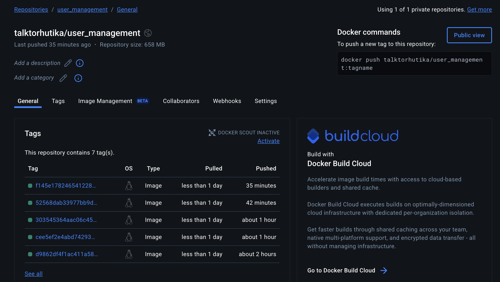
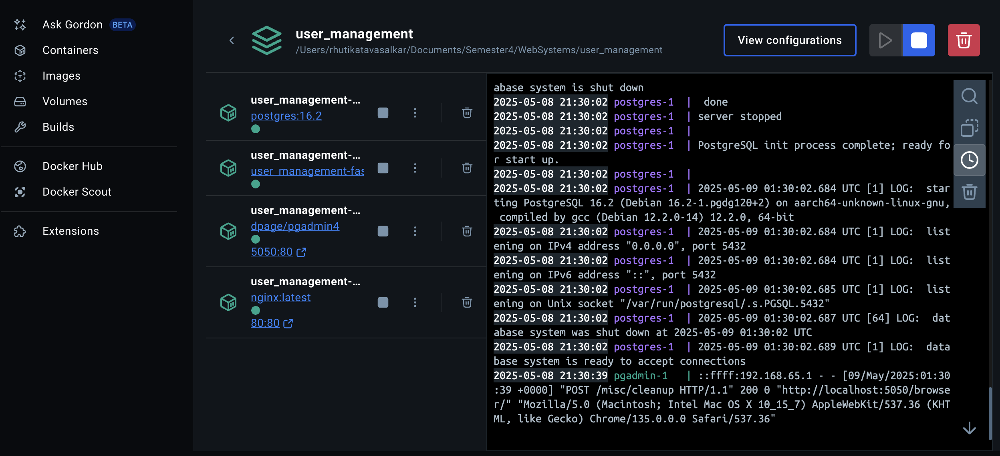
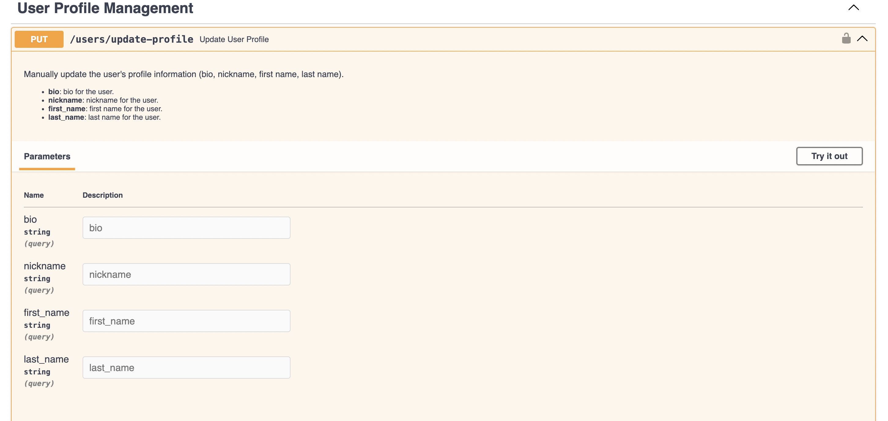
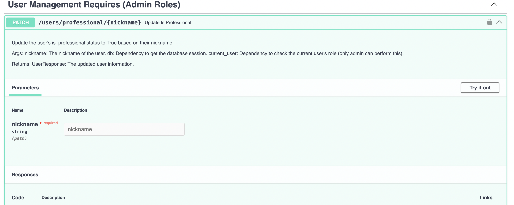

# User Management System — Final Project

## Closed Issues Documentation
Issue #1 - Email Verification

Description: The email verification process was not functioning correctly due to a misconfiguration with Mailtrap. As a result, verification emails were not being delivered, and users were marked as verified without completing the verification process. This issue was resolved by correctly integrating Mailtrap, enabling the system to send verification links to registered users. Users are now marked as verified only after successfully confirming their email addresses.

Issue #2 - Admin verification handling

Descripton: The first registered user—designated as the admin—was being marked as verified automatically without completing email verification through Mailtrap. Although the system assigns admin rights to the first user, the email verification step should still be enforced to ensure account authenticity

Issue #3 - Password logic implementation

Description: The password must contain at least one digit, one special character, one uppercase letter, one lowercase letter, and be a minimum of 10 characters long.

Issue #4 - Skip and Limit Values Validation

Description: When retrieving the user list, entering negative values for skip or limit does not trigger a validation error. Instead, the API incorrectly returns a 200 OK response, which could lead to unexpected behavior or security concerns. Proper validation should be enforced to reject negative input values.

Issue #5 - is_professional Flag Not Reflecting Update

Description: Even after updating the is_professional field to true in the database, the API response continues to show it as false. This indicates a possible caching issue, serialization error, or failure to fetch the latest data from the database.

# Docker Hub Repo
You can view the Docker Repo [here](https://hub.docker.com/repository/docker/talktorhutika/user_management/general).

# Docker Hub Image
[]

# Docker Desktop Image
[]

# New Feature: User Profile Management
This feature introduces the ability for users to manage and update their profile information. Additionally, it provides managers and administrators with the capability to elevate users to professional status.

Check out the [User Profile Feature][profile-feature].
[profile-feature]: https://github.com/TalkToRhutika/user_management/tree/new_feature

1. Update User Profile
[]

1. Update User's Professional Status
[]

# What I Learned from This Project
This project gave me hands-on experience with real-world software development, especially within the context of user management systems. I learned how to work effectively in a collaborative team environment—contributing to feature development, resolving bugs, and maintaining code quality.

By implementing new functionality, I followed industry-standard practices for coding, testing, and documentation. I also improved test coverage by identifying gaps and writing additional tests to handle edge cases and potential failures.

Additionally, I gained practical experience with essential development tools such as Git for version control, Docker for containerized deployment, and CI pipelines for automated testing. Debugging and troubleshooting throughout the project further sharpened my problem-solving skills. Overall, this experience strengthened both my technical capabilities and my understanding of professional development workflows.